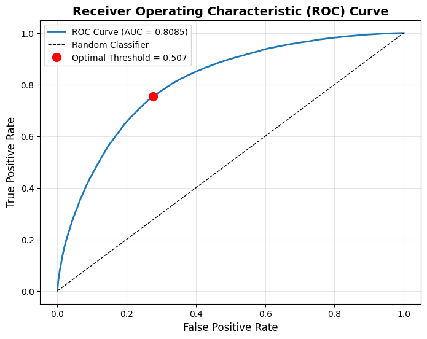
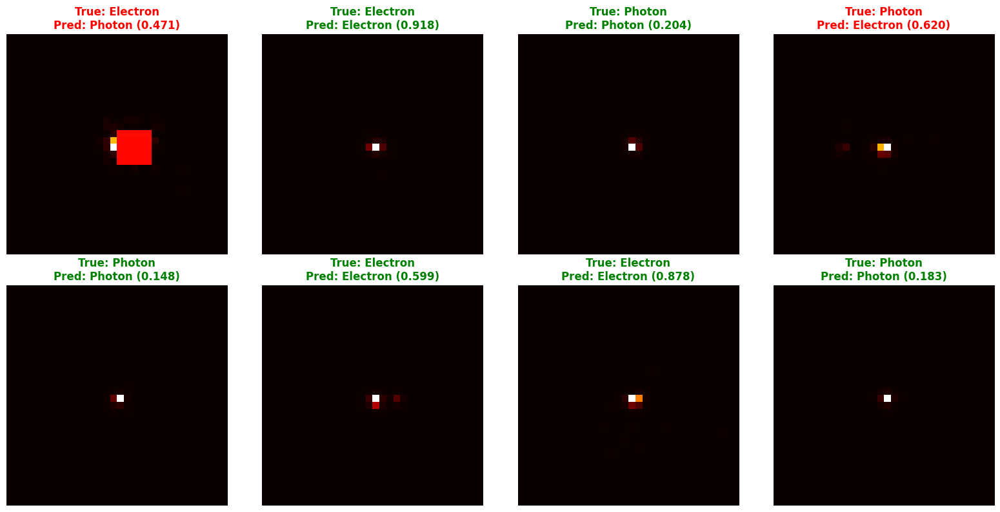
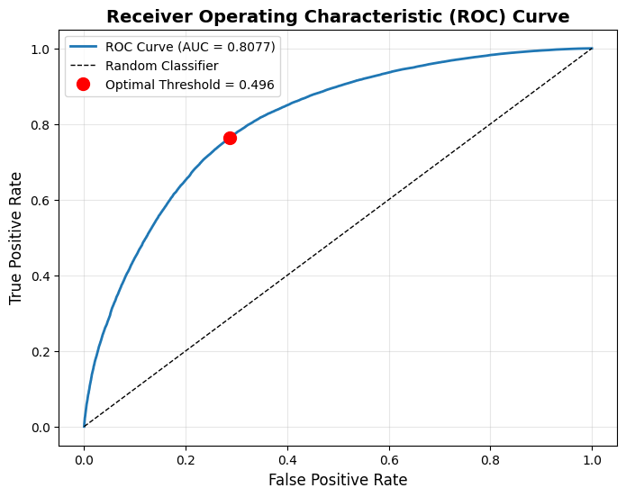
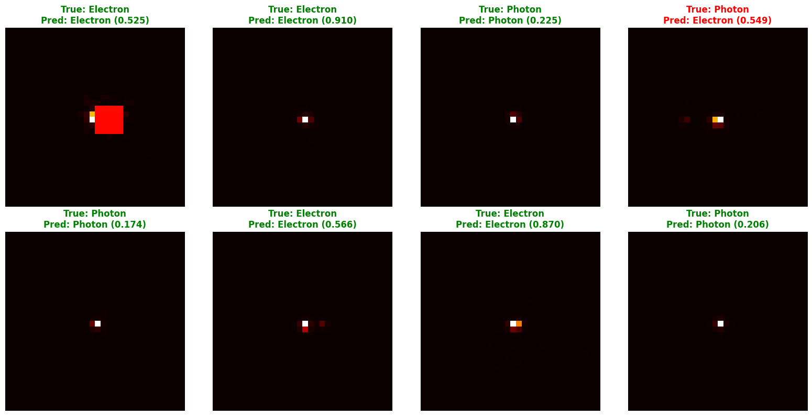

# Binary Particle Classification Challenge: ViT vs CCT

<div align="center">
  <h3>Deep Learning Solutions for High-Energy Physics Particle Detection</h3>
  <p><i>Reproduction of the DeepLearn Hackathon 2025 Problem Statement</i></p>
</div>

---

## Overview

This repository contains implementations of **Vision Transformers (ViT)** and **Compact Convolutional Transformers (CCT)** for binary particle classification (Photon vs. Electron) using calorimeter images from high-energy physics experiments.

### Important Note

**This work is a reproduction of the problem statement from the DeepLearn Hackathon 2025, not a direct submission.** This is a personal attempt to implement and explore the challenge several months after the hackathon's conclusion. The goal is to understand and apply modern deep learning techniques to particle physics classification problems.

### Implementation Context

Due to hardware limitations and to maximize training speed, both solutions were implemented and executed in **Kaggle Notebooks** with access to GPU resources. The notebooks provide:
- Efficient data loading and preprocessing
- Mixed precision training (AMP)
- Optimized architectures for the 32×32×2 image dataset
- Comprehensive evaluation metrics and visualizations

---

## Dataset

- **Particle Types**: Single Photon (Pt 50 GeV) vs. Single Electron (Pt 50 GeV)
- **Image Size**: 32×32 pixels
- **Channels**: 2 (Energy deposits + Timing information)
- **Total Samples**: ~249,000 images
- **Split**: 70% train, 15% validation, 15% test

---

## Results

### Vision Transformer (ViT)

| Metric | Value |
|--------|-------|
| **Best Validation AUC** | 0.8068 |
| **Test Accuracy** | 73.84% |
| **Test AUC** | 0.8085 |
| **Optimal Threshold** | 0.5073 |
| **TPR (at optimal)** | 0.7532 |
| **FPR (at optimal)** | 0.2755 |
| **Epochs Trained** | 91 |

**Classification Report (ViT):**
```
              precision    recall  f1-score   support
      Photon       0.75      0.72      0.74     37406
    Electron       0.73      0.75      0.74     37294
    accuracy                           0.74     74700
   macro avg       0.74      0.74      0.74     74700
weighted avg       0.74      0.74      0.74     74700
```

**Confusion Matrix (ViT):**
```
                Predicted
              Photon  Electron
Actual Photon    27114   10292
     Electron     9226   28068
```

**ROC Curve and Predictions (ViT):**

<div align="center">
  
  <p><i>ViT ROC Curve with optimal threshold marked</i></p>
</div>

<div align="center">
  
  <p><i>Sample ViT predictions on test set (8 random samples showing energy channel)</i></p>
</div>

### Compact Convolutional Transformer (CCT)

| Metric | Value |
|--------|-------|
| **Best Validation AUC** | 0.8057 |
| **Test Accuracy** | 73.83% |
| **Test AUC** | 0.8077 |
| **Optimal Threshold** | 0.4961 |
| **TPR (at optimal)** | 0.7645 |
| **FPR (at optimal)** | 0.2871 |
| **Epochs Trained** | 88 |

**Classification Report (CCT):**
```
              precision    recall  f1-score   support
      Photon       0.75      0.71      0.73     37406
    Electron       0.73      0.76      0.74     37294
    accuracy                           0.74     74700
   macro avg       0.74      0.74      0.74     74700
weighted avg       0.74      0.74      0.74     74700
```

**Confusion Matrix (CCT):**
```
                Predicted
              Photon  Electron
Actual Photon    26670   10736
     Electron     8787   28507
```

**ROC Curve and Predictions (CCT):**

<div align="center">
  
  <p><i>CCT ROC Curve with optimal threshold marked</i></p>
</div>

<div align="center">
  
  <p><i>Sample CCT predictions on test set (8 random samples showing energy channel)</i></p>
</div>

### Performance Comparison

Both models achieve **very similar performance**:
- **ViT**: 73.84% accuracy, 0.8085 AUC
- **CCT**: 73.83% accuracy, 0.8077 AUC

**Key Insights:**
- ViT achieves slightly better overall accuracy and AUC
- CCT shows better recall for electron detection (76% vs 75%)
- Both models have comparable precision (~0.74-0.75)
- Training converged faster with CCT (88 vs 91 epochs)
- ViT has slightly lower false positive rate (0.2755 vs 0.2871)

---

## Architecture Overview

### Vision Transformer (ViT)

**Pipeline:**
```
Input (32×32×2)
↓
[Patch Embedding]  ← Divide into patches + linear projection
↓
[CLS Token]  ← Special learnable token for classification
↓
[Positional Encoding]  ← Absolute positional embeddings
↓
[Transformer Encoder × N]  ← Multi-head attention + MLP
↓
[Classification Head]  ← MLPtoclass logits
↓
Output (Binary Classification)
```

**Key Components:**
- Patch size: 4×4 (64 patches for 32×32 images)
- Embedding dimension: 256
- Transformer layers: 12
- Attention heads: 8
- MLP ratio: 4

**Advantages:**
- Strong performance on small to medium datasets with proper regularization
- Captures long-range dependencies effectively
- Well-suited for structured image patches

### Compact Convolutional Transformer (CCT)

**Pipeline:**
```
Input (32×32×2)
↓
[Convolutional Tokenizer]  ← Conv layers + pooling (8×8 = 64 tokens)
↓
[Linear Projection]  ← Project to embedding dimension
↓
[Positional Encoding]  ← Optional learnable embeddings
↓
[Transformer Encoder × N]  ← Multi-head attention + MLP + Stochastic Depth
↓
[Sequence Pooling]  ← Attention-based aggregation
↓
[Classification Head]  ← MLP layers → Binary output
↓
Output (Binary Classification)
```

**Key Components:**
- Conv layers: 2 (with 64, 128 output channels)
- Embedding dimension: 128
- Transformer layers: 6
- Attention heads: 4
- Stochastic depth: 0.05
- Sequence pooling: Attention-based

**Advantages:**
- Specifically designed for small datasets
- Stronger inductive bias via convolutional tokenization
- Better data efficiency than standard ViT
- Fewer parameters (~0.4M vs ~4.7M for ViT)

---

## Why Two Different Approaches?

| Feature | ViT | CCT |
|---------|-----|-----|
| **Tokenization** | Patch embedding | Convolutional layers |
| **Inductive Bias** | Minimal | Strong (via convolutions) |
| **Positional Encoding** | Required | Optional |
| **Pooling** | CLS token | Sequence pooling |
| **Data Efficiency** | Needs large datasets | Works with small datasets |
| **Parameters** | Higher | Lower |
| **Computation** | Higher | Lower |

---

## Training Setup

### Data Augmentation

Both models use physics-appropriate augmentations:
- **Rotations**: 90° multiples (respects detector symmetry)
- **Flips**: Horizontal and vertical (respects detector symmetry)
- **Energy Scaling**: Simulates calibration variations
- **Noise Addition**: Simulates detector noise (Gaussian)

### Optimization

- **Optimizer**: AdamW
- **Learning Rate**: 5×10⁻⁴ with warmup cosine scheduling
- **Weight Decay**: 1×10⁻⁴
- **Batch Size**: 64
- **Loss Function**: Binary Cross Entropy with Label Smoothing (α=0.1)
- **Mixed Precision**: Enabled (AMP)
- **Gradient Clipping**: 1.0

### Regularization

- **Dropout**: 0.15
- **Attention Dropout**: 0.1
- **Label Smoothing**: 0.1
- **Stochastic Depth** (CCT only): 0.05

---

## Files Structure

```
binary_particle_classification/
├── README.md                              # This file
├── my-vit-ml4sci (working).ipynb         # Vision Transformer implementation
├── my-cct-ml4sci.ipynb                   # Compact Convolutional Transformer
├── cct.ipynb                              # CCT variant
├── vit.ipynb                              # ViT variant
└── results/
    ├── ViT/
    │   ├── training_history.png           # Loss, accuracy, AUC curves
    │   ├── roc_curve.png                  # ROC curve with optimal threshold
    │   └── predictions_visualization.png  # Sample predictions
    └── CCT/
        ├── training_history.png           # Loss, accuracy, AUC curves
        ├── roc_curve.png                  # ROC curve with optimal threshold
        └── predictions_visualization.png  # Sample predictions
```

---

## How to Run

### Prerequisites

```bash
pip install torch torchvision pytorch-cuda=11.8
pip install numpy scikit-learn matplotlib tqdm h5py
```

### Kaggle Notebook Setup

1. Create a new Kaggle notebook
2. Add the dataset: "Electron-Photon Dataset"
3. Copy the notebook content
4. Mount Google Drive (if needed for data): `from google.colab import drive; drive.mount('/content/drive')`
5. Run cells sequentially

### Local Execution

The notebooks are self-contained and can be run locally with appropriate data paths:

```python
# Update data paths in configuration
photon_path = "/path/to/SinglePhotonPt50_IMGCROPS_n249k_RHv1.hdf5"
electron_path = "/path/to/SingleElectronPt50_IMGCROPS_n249k_RHv1.hdf5"
```

---

## References

### Vision Transformers
- **Paper**: [An Image is Worth 16x16 Words: Transformers for Image Recognition at Scale](https://arxiv.org/abs/2010.11929) (Dosovitskiy et al., 2021)
- **Keras Implementation**: [Vision Transformer](https://keras.io/examples/vision/image_classification_with_vision_transformer/)

### Compact Convolutional Transformers
- **Paper**: [Escaping the Big Data Paradigm with Compact Transformers](https://arxiv.org/abs/2104.05704) (Hassani et al., 2021)
- **Keras Example**: [Compact Convolutional Transformers](https://keras.io/examples/vision/cct/)
- **GitHub**: [SHI-Labs/Compact-Transformers](https://github.com/SHI-Labs/Compact-Transformers)

### DeepLearn Hackathon
- **Challenge**: [ML4SCI Particle Images Challenge](https://ml4sci.org)
- **Repository**: [DeepLearnHackathon](https://github.com/ML4SCI/DeepLearnHackathon)

### High-Energy Physics Context
- **Dataset**: LHC Calorimeter Data from CERN
- **Challenge**: Binary classification of elementary particles in collision events
- **Metric**: ROC-AUC for detector-level classification

---

## Key Takeaways

1. **Comparable Performance**: Both ViT and CCT achieve ~74% accuracy and ~0.81 AUC on this dataset
2. **Efficient Alternatives**: CCT demonstrates that transformers can be data-efficient with proper architectural choices
3. **Rapid Convergence**: Both models converge within 100 epochs without aggressive early stopping
4. **Physics-Aware Augmentation**: Simple domain-specific augmentations (rotations, flips, energy scaling) significantly help
5. **Threshold Optimization**: Optimal classification thresholds differ between models (0.5073 vs 0.4961), highlighting the importance of threshold tuning

---

## Citation

If you use this work in your research, please cite the original DeepLearn Hackathon challenge:

```bibtex
@misc{ML4SCI2025,
  title={DeepLearn Hackathon 2025: Particle Images Challenge},
  author={ML4SCI},
  year={2025},
  url={https://ml4sci.org}
}
```

---

## License

This project is for educational and research purposes. The original dataset and challenge are provided by ML4SCI and CERN.

---

<div align="center">
  <p><b>ML4SCI DeepLearn Hackathon - Particle Images Challenge</b></p>
  <p>Reproduction Study | June 2026</p>
</div>
